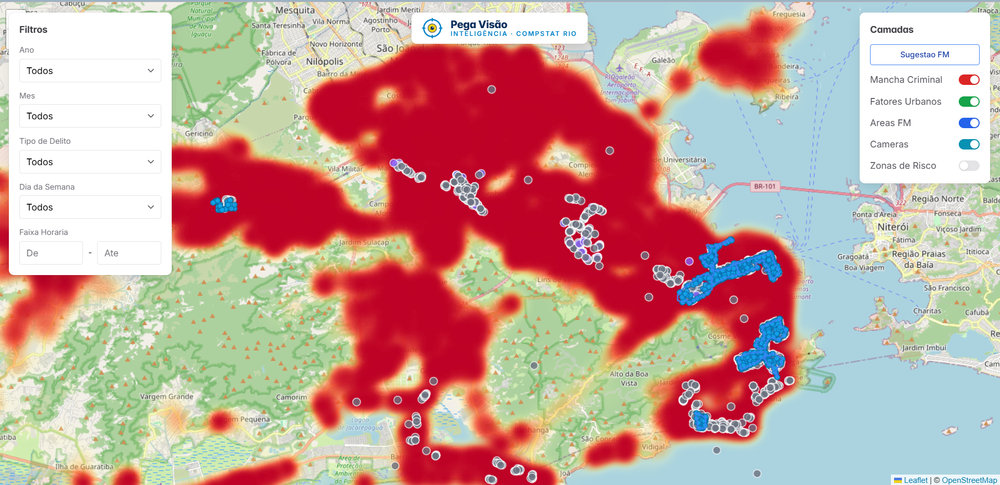
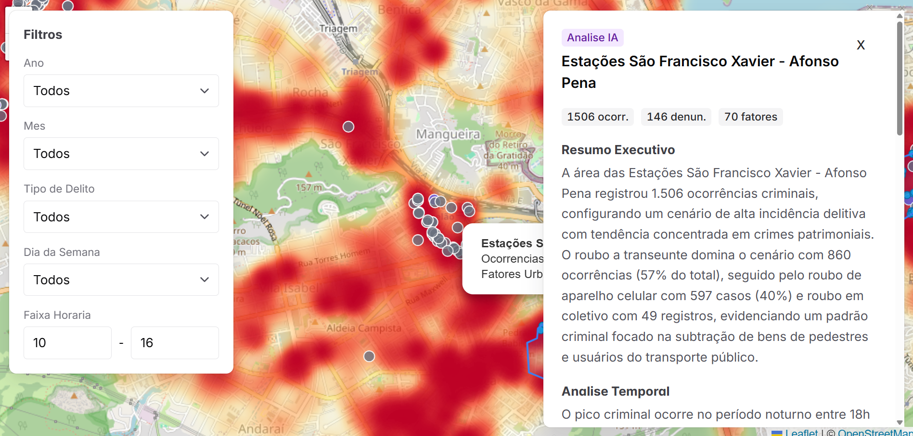
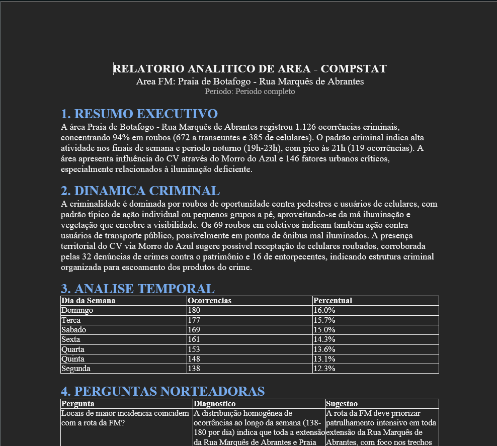
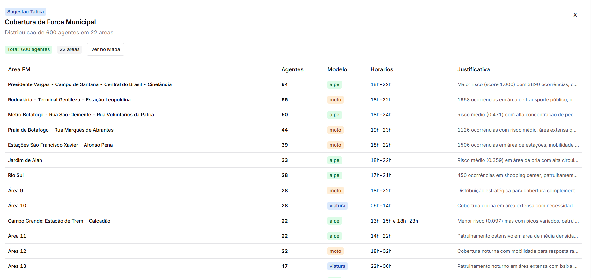

<p align="center">
  
</p>

<p align="center">
  🔗 <a href="https://www.pegavisao.xyz/"><strong>Pega Visão</strong></a>
</p>
<p align="center"><strong>Plataforma de Inteligência Criminal do CompStat Rio</strong></p>
 
> De **horas** para **minutos**: cruzamento geoespacial automatizado e relatórios analíticos gerados por IA para as reuniões semanais do CompStat Municipal do Rio de Janeiro.
 
---

## Sumário

- [Contexto](#contexto)
- [O Problema](#o-problema)
- [A Solução](#a-solução)
- [Funcionalidades](#funcionalidades)
- [Arquitetura](#arquitetura)
- [Stack Tecnológica](#stack-tecnológica)
- [Início Rápido](#início-rápido)
- [Variáveis de Ambiente](#variáveis-de-ambiente)
- [Estrutura do Projeto](#estrutura-do-projeto)
- [Datasets](#datasets)
- [Roadmap](#roadmap)
- [Créditos](#créditos)
- [Licença](#licença)

---

## Contexto

Toda semana, a equipe do **CompStat Municipal** precisa responder à mesma pergunta: *onde colocar os 600 agentes da Força Municipal para ter o maior impacto possível?*

A resposta mora dentro de cinco bases de dados diferentes — ocorrências, denúncias, fatores urbanos, RELINTs e shapefiles — que hoje são cruzadas à mão, em planilhas, por analistas que passam mais tempo formatando tabela do que lendo o território. O resultado é um ciclo semanal apertado, onde a inteligência chega tarde e a decisão operacional corre atrás do prejuízo.

## O Problema

Os dados que orientam o policiamento vivem em **silos desconectados**:

| Fonte | Volume | Formato |
|---|---|---|
| Ocorrências georreferenciadas | ~115 mil registros | `.csv` |
| Denúncias (Disque Denúncia) | ~83 mil registros | `.csv` |
| Fatores urbanos mapeados em campo | ~2 mil pontos | `.csv` |
| RELINTs (Relatórios de Inteligência) | dezenas de documentos | `.docx` |
| Áreas prioritárias da FM | 22 polígonos | `.shp` |

Cruzar tudo isso manualmente consome o tempo do analista — que deveria estar **interpretando** dados, não montando planilhas.

## A Solução

**Pega Visão** integra as cinco fontes num único banco geoespacial e usa a **Claude API** para amplificar a capacidade analítica da equipe do CompStat.

Na plataforma há filtros e seletores disponíveis para que o analista consiga consultar regioes e
gerar relatorios mais precisos


## Funcionalidades

### 🗺️ Mapa Interativo
Mancha criminal, fatores urbanos, câmeras e os 22 polígonos da FM em camadas controláveis com filtros temporais e por tipologia.



### ⚠️ Coincidências de Alto Risco
Identificação automática de pontos onde crime + fator urbano + denúncia se sobrepõem no mesmo raio, com scoring de criticidade para priorização.

### 🤖 Análise de Área por IA
Síntese executiva, série temporal, dinâmica criminal e diagnóstico de fatores urbanos — tudo gerado por IA e pronto para a reunião semanal.




### 📄 Geração de RELINT em `.docx`
Relatório de Inteligência exportado com um clique, já no formato padronizado do CompStat.



### 👮 Sugestão de Cobertura da FM
Distribuição otimizada dos 600 agentes pelas 22 áreas, com modelo de emprego (a pé, moto ou viatura) e turnos prioritários baseados na série temporal de ocorrências.




### 🏗️ Plano de Ação por Órgão
Fatores urbanos agrupados por responsável (Comlurb, RioLuz, SEOP, CET-Rio, SMAS…) e priorizados por risco, prontos para encaminhamento intersetorial.

### 📡 Inteligência de Redes Sociais
Monitoramento de publicações sobre crimes nas 22 áreas, classificados automaticamente por IA quanto a tipo, localização e relevância.

## Arquitetura

```
┌─────────────┐     ┌──────────────────┐     ┌──────────────┐
│  Front-end   │────▶│  Next.js API      │────▶│  Neon        │
│  React 19    │     │  Routes           │     │  PostgreSQL  │
│  Leaflet     │     │                   │     │  + PostGIS   │
│  Chakra UI   │     │  ┌─────────────┐  │     └──────────────┘
└─────────────┘     │  │ Claude API  │  │
                     │  │ (análises)  │  │
                     │  └─────────────┘  │
                     └──────────────────┘
```

## Stack Tecnológica

| Camada | Tecnologia |
|---|---|
| Framework | Next.js 15 (App Router) |
| UI | React 19 + Chakra UI v3 |
| Mapas | react-leaflet + Leaflet |
| Banco de Dados | Neon PostgreSQL + PostGIS |
| IA | Claude API (Anthropic) |
| Documentos | biblioteca `docx` (geração de `.docx`) |

## Início Rápido

### Pré-requisitos

- Node.js ≥ 18
- Conta no [Neon](https://neon.tech) (PostgreSQL gerenciado com PostGIS)
- Chave de API da [Anthropic](https://console.anthropic.com)

### Instalação

```bash
# 1. Clone o repositório
git clone https://github.com/seu-usuario/pega-visao.git
cd pega-visao

# 2. Instale as dependências
npm install

# 3. Configure as variáveis de ambiente
cp .env.example .env.local
# Edite .env.local com suas credenciais (ver seção abaixo)

# 4. Popule o banco com os dados-fonte
npm run db:migrate
npm run db:seed        # importa CSVs de base_data/dados/

# 5. Inicie o servidor de desenvolvimento
npm run dev
```

A aplicação estará disponível em `http://localhost:3000`.

## Variáveis de Ambiente

| Variável | Descrição |
|---|---|
| `DATABASE_URL` | Connection string do Neon PostgreSQL |
| `ANTHROPIC_API_KEY` | Chave de API da Anthropic |

Consulte `.env.example` para a lista completa.

## Estrutura do Projeto

```
pega-visao/
├── src/                  # Aplicação Next.js (App Router)
│   ├── app/              #   Rotas e páginas
│   ├── components/       #   Componentes React
│   └── lib/              #   Utilitários, clients e helpers
├── db/                   # Schema PostGIS e migrations
├── scripts/              # Scripts de importação dos datasets
├── base_data/            # Dados-fonte do desafio
│   ├── dados/            #   CSVs de ocorrências, denúncias, fatores
│   └── README.md         #   Dicionário de dados
├── docs/
│   ├── stories/          # User stories (modelo INVEST)
│   └── plans/            # Planos de implementação
└── .env.example          # Template de variáveis de ambiente
```

## Datasets

Os dados utilizados são fornecidos pelo CompStat Municipal e estão em `base_data/`. Consulte [`base_data/README.md`](base_data/README.md) para o dicionário completo de campos e as instruções de importação detalhadas em `scripts/`.

> **Nota:** os dados reais são sensíveis e não são versionados. O repositório inclui apenas amostras anonimizadas para desenvolvimento.

## Créditos

Desenvolvido durante o **Claude Impact Lab Rio 2026** sobre o briefing do CompStat Municipal — Prefeitura do Rio de Janeiro.

## Licença

<!-- Substitua pela licença escolhida pelo time -->
[MIT](LICENSE)